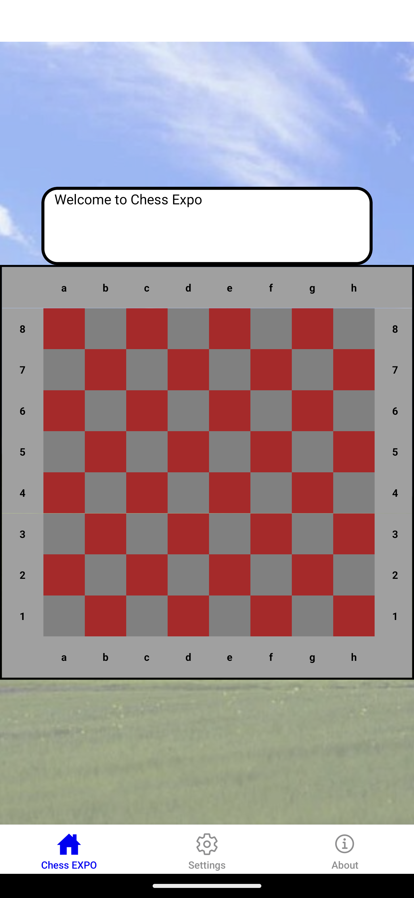

# Welcome to Chess Expo, an app built using React Native and Expo. This app serves as a GUI to interface with the instances of Stockfish hosted at <https://expo-chess-back.onrender.com/uci> (repo: <https://github.com/dan-suen/expo-chess-back>)
## As such, this requires a working internet connection to fully function

## Features:
- Play a chess game as Black or White against Stockfish
- Dark Mode
- Choose your own music
- Choose your own background

#### Known Bugs: 
- Dropping Internet connection or resuming the application after some time may cause inconsistent game state
- Promotions may not work as expected (only knights avaliable)
- Delayed POST responses (due to server being inactive) occurs on first couple of turns after inactivity. Opposing pieces can be moved at this time

#### Upcoming Features:
- Win messages for the player
- Local offline 2 player mode
- Difficulty levels

## Acknowledgments

This project uses [Stockfish](https://stockfishchess.org/) distributed under the [GNU General Public License v3 (GPL v3)](https://www.gnu.org/licenses/gpl-3.0.txt).

### License Compliance

Stockfish is open-source software, and as per the GPL v3 license, the full source code of Stockfish can be found [here](https://github.com/official-stockfish/Stockfish). If this project distributes a modified version of Stockfish, the modified source code will be made available in accordance with GPL v3.

For more details on GPL v3, refer to the official [GPL v3 License](https://www.gnu.org/licenses/gpl-3.0.txt).
